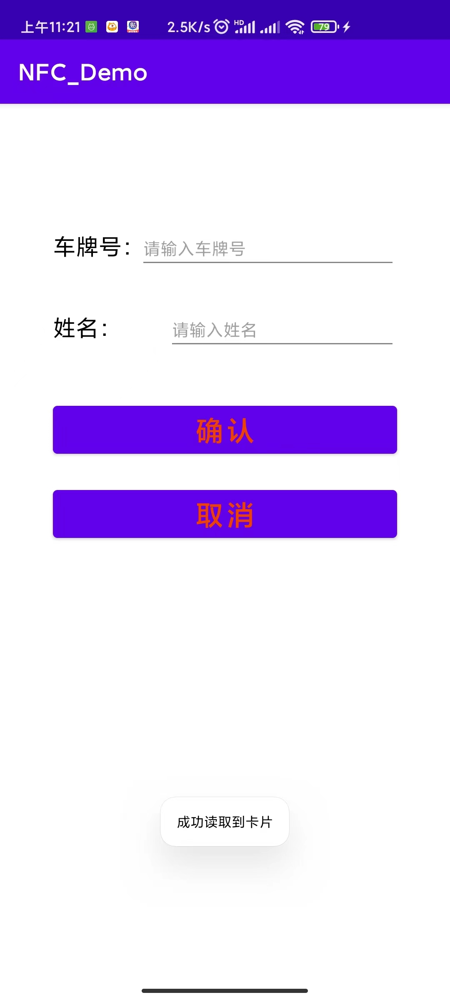
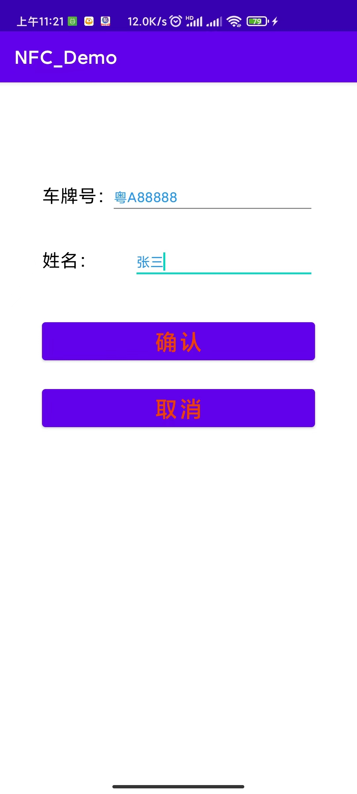
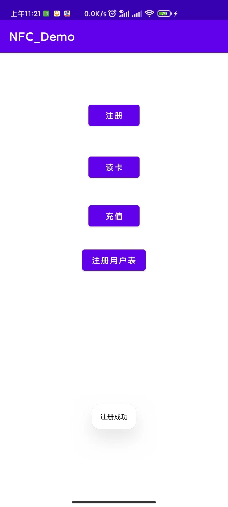
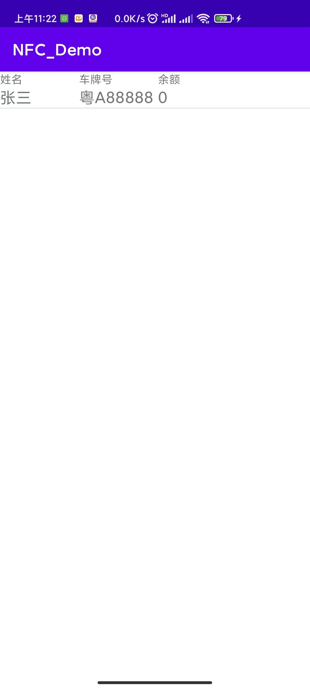
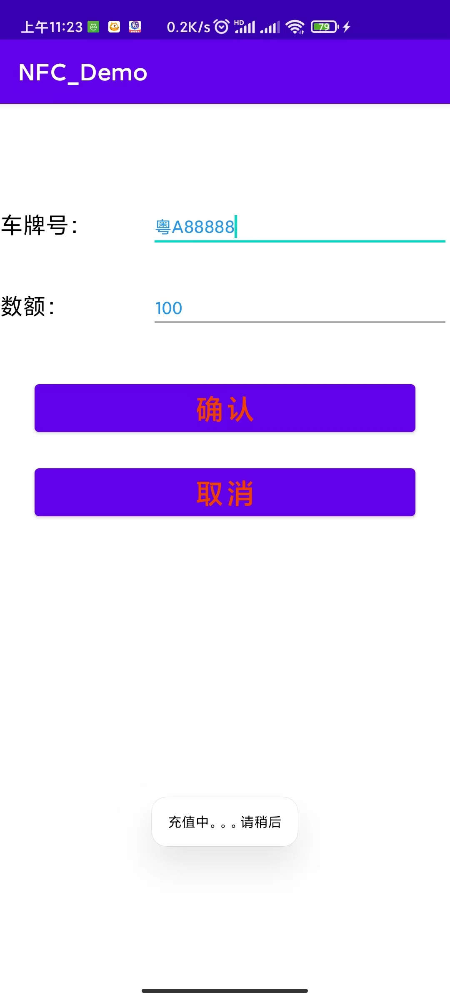
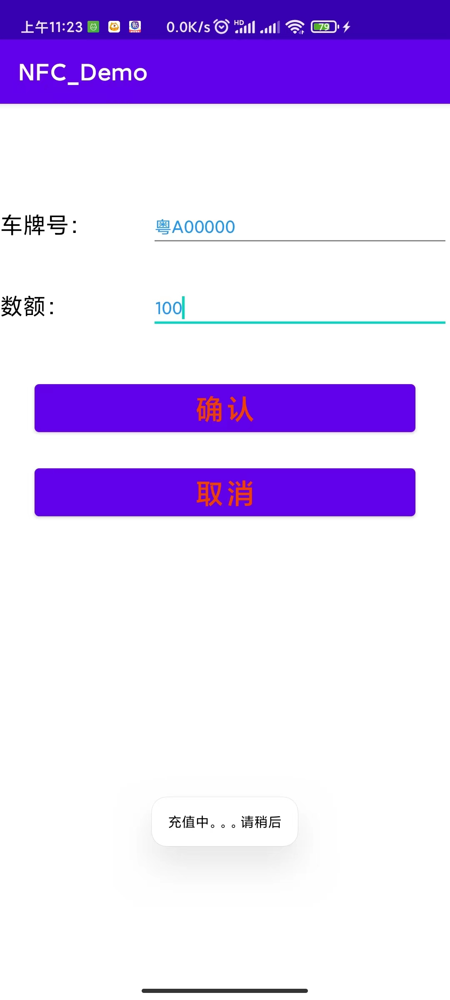
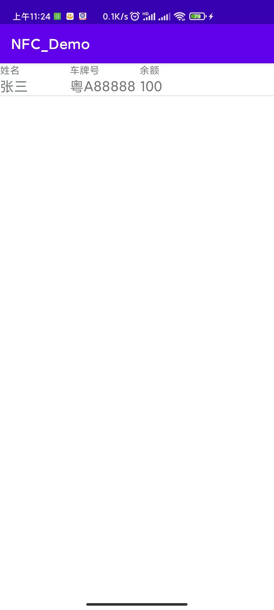
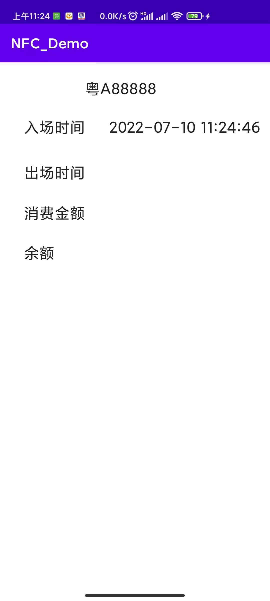
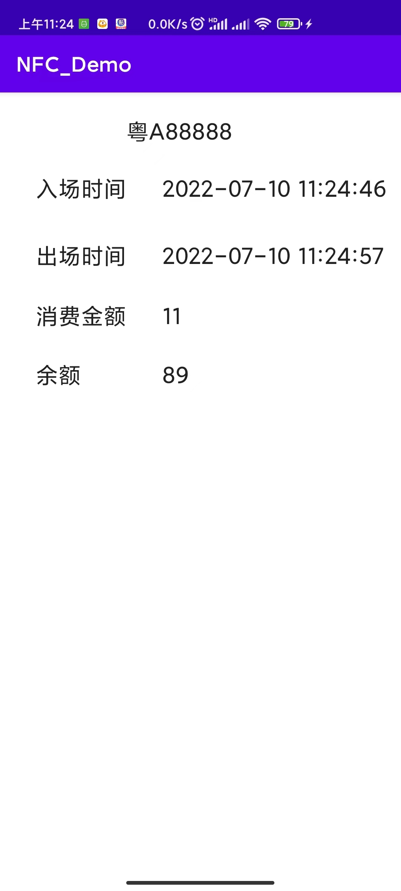
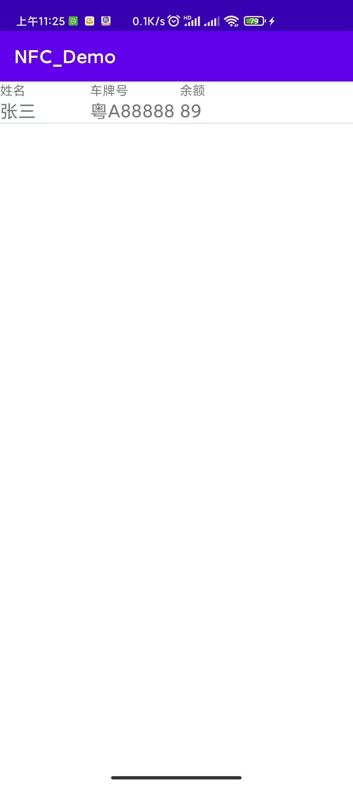

# NFC_Demo

//主界面
- 

//进入注册界面 会提醒打开NFC
- 

//将高频卡紧贴手机 识别成功 读取到卡片uid
- 

//输入信息 进行绑定
- 

//跳转至注册成功界面
- 

//进入注册用户表查看最初信息
- 

//进入充值界面 填入相关信息进行充值
- 

//成功充值
- 

//进入充值界面 填入不相关信息进行充值
- 

//充值失败
- 

//进入注册用户表查看余额
- 

//进入读卡界面 并将卡片贴近手机
- 

//将卡远离手机 再次贴近 （为方便观察 设置了一秒一块钱）
- 

//进入注册用户表查看余额
- 
